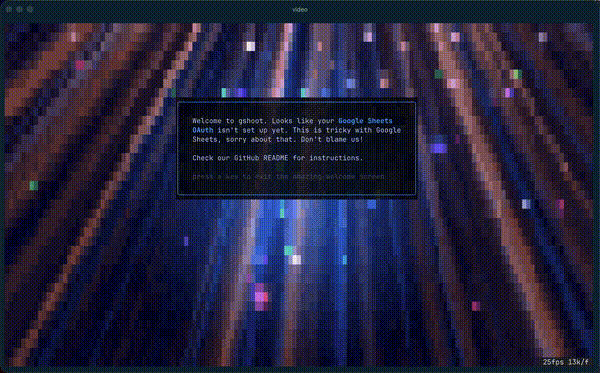

If you flipped through this guide you probably learned something about ANSI. At the very least you've plumbed the limits of my personal knowledge. This chapter is for diehards needing a bit more. Also, in all honesty a dumping ground for topics that I would like to understand better. Pardon my ignorance.

### terminfo

[terminfo](https://invisible-island.net/ncurses/terminfo.src.html) is a giant database that describes the specific capabilities of all the terminals that ever lived. How many colors? Which escape codes are supported? This is like cracking open a tomb, it's astonishing the sheer number of terminals that have come and gone. [termcap](https://github.com/sctg-development/termcap/blob/main/termcap.src)+curses did the same thing and were part of the original BSD release, way back in 1980. Eventually termcap was superseded by terminfo+ncurses.

For fun, look in the terminfo file and search for something modern like `ghostty` or `warp`. That file is so salty, I love it. "Its readme and man page begin with a lot of hype" or "of interest only to the numerically illiterate"

Most modern libs don't use terminfo. We have fewer terminals, and most terminals support a common subset of ANSI escapes. The stuff that most of us care about, the stuff on my [ANSI Escape Codes](/escapes) page. There's an [epic anti-terminfo rant](https://twoot.site/@bean/113056942625234032) which you may enjoy. The gist is that terminfo is out of date, overly fussy, and not really needed anymore.

### Obscure Yet Handy

- **clear, reset** - These are ansi escape codes and also corresponding cli commands. Remember that these are just magic strings sent to your terminal, which must react accordingly. **Clear** wipes the current screen and **reset** resets the terminal entirely, including scrollback. These escape codes are mostly standardized these days, but if you run the `clear` or `reset` utils they will look up the escape code from terminfo and echo it to your terminal. You can also try `stty sane`, which attempts to restore some defaults to your terminal using escape codes. `reset` mostly does the same thing, but also sends the reset escape code. Typing `ctrl+l` into bash/zsh/etc usually ends up sending the `clear` ansi escape code as well.

  Sometimes my terminal is too borked to accept commands. This happens surprisingly often when working on cli apps over ssh. In that case I try both `stty sane` and the ghostty **Reset Terminal** command.

- **multiplexers/detachers** - These are apps like `tmux`, `screen`, [zellij](https://zellij.dev), github/herdrdev/herdr, github/crigler/dtach, github/neurosnap/zmx and many others. tmux uses a master server process to manage a bunch of TTYs. You can switch between TTYs and they stay alive even if your session dies. dtach/zmx are simpler apps that sorta do the same thing, but for a single shell process. Instead of tmux managing lots of shells, you open lots of tabs in your terminal and run dtach or zmx in each one.

  There is a rich history here, but IMO these tools are going to be subsumed by next-gen terminals that have dtach-like behavior builtin. LLM usage is acting as a catalyst. At the moment I use ghostty+zmx.

- **readline** - a gnu lib for reading a line of text from the user. Yes, there's an entire library for that and it supports things like customized keybindings (emacs/vim), internal copy and paste, etc. For a long time this task (reading a line) was complicated enough that we needed dedicated, supported libraries to get it done. Still used by many apps, and readline has been ported to many other languages.

- **tput** - A cli wrapper for terminfo. It can look things up, and print them too. For example, `tput reset` prints the reset string from terminfo.

### Video Playback

These days terminals are fast enough to play videos as streams of bg colors. I'm not talking about ascii art (which is a whole separate thing) but pixelated full-color video. I have a half-baked cli app that shows a looping video as an intro screen. The app itself is a crappy subset of github/openclaw/gogcli, but I wanted it to be more exciting:



I started with a 5s video file, converted each frame to png, downsampled to something reasonable for terminals, shrank the pngs with pngquant, and then embedded the frames into my go app. If you want to attempt this, here are a few random ideas to consider:

- Alpha blending is possible in a crude way, so you can (for example) draw a lipgloss card on top of the video as seen above.
- Technically you can double the resolution by using the unicode "half block" char in the fg, but terminals are mostly too slow to make it worthwhile.
- It can be more efficient to render diffs (using ansi cursor movement) instead of full frames. Depends on the video.
- Even simple videos look bad in ansi 256. Use truecolor.
- Adjust fps if your terminal can't handle the speed. You may even want to hack in some `$TERM_PROGRAM` logic to guess throughput.
- Embedding a video will inevitably bloat the binary. I used a 5s loop w/pngquant and it came out nice.

### Banner/Warning/Fatal

Here are three nice color helpers I use religiously. Once you get used to these it's hard to go back.

```just
# just
banner +ARGS:  (_banner '\e[48;2;64;160;43m' ARGS)
warning +ARGS: (_banner '\e[48;2;251;100;11m' ARGS)
fatal +ARGS:   (_banner '\e[48;2;210;15;57m' ARGS)
  exit 1
_banner BG +ARGS:
  printf '\e[38;5;231m{{BOLD+BG}}[%s] %-72s {{NORMAL}}\n' "$(date +%H:%M:%S)" "{{ARGS}}"
```

```rb
# ruby
GREEN = "64;160;43"
YELLOW = "251;100;11"
RED = "210;15;57"

def banner(str, color = GREEN)
  now = Time.now.strftime("%H:%M:%S")
  printf "\e[1;38;5;231;48;2;%sm[%s] %-72s \e[0m\n", color, now, str
end
def warning(str)
  banner(str, YELLOW)
end
def fatal(str)
  banner(str, RED)
  exit 1
end
```

```sh
# sh
GREEN="64;160;43"
YELLOW="251;100;11"
RED="210;15;57"

banner() {
  color="${2:-$GREEN}"
  printf "\e[1;38;5;231;48;2;%sm[%s] %-72s \e[0m\n" "$color" "$(date '+%H:%M:%S')" "$1"
}
warning() {
  banner "$1" "$YELLOW"
}
fatal() {
  banner "$1" "$RED"
  exit 1
}
```
