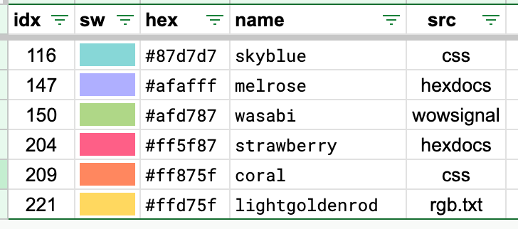

import Ansi256Table from "@/components/Ansi256Table.astro";
import Ansi256Chart from "@/components/Ansi256Chart.astro";
import Ansi256FullChart from "@/components/Ansi256FullChart.astro";

The ANSI 256 color cube is generated algorithmically (see the [Color Design](/colors) page) and there have been various efforts to come up with nice names for the colors. This is handy, because I hate embedding random ints into my code. Give me names pls.

Without further ado here is my own attempt at naming the ANSI 256 color palette. I spent quite a bit of time coming up with the best name for each color:

1. Using perceptual distance, is there a close [css named color](https://developer.mozilla.org/en-US/docs/Web/CSS/Reference/Values/named-color)? (91 names)
1. Is there a close [X11 color](https://en.wikipedia.org/wiki/X11_color_names)? Ignore names with digits. (3 names)
1. Use `gray1-24` for the the 232..255 grays in addition to any css name.
1. If all else fails, pick something evocative from the proposals at [hexdocs](https://color-palette.hexdocs.pm/ansi_color_codes.html) or [wowsignal](https://www.wowsignal.io/articles/xterm256). Thanks guys! (128 names)

Now I can change tennis colors to `skyblue`, `melrose`, `wasabi`, `strawberry`, `coral`, and `lightgoldenrod` instead of `116, 147, 150, 204, 209, 221`. Screenshot from my spreadsheet:

### Pretty Chart

  Illustration courtesy of <a href="https://www.hackitu.de/termcolor256/">hackitude</a>. Note that not all 256 colors
  are shown in this lovely chart, scroll down for the full definition.

<Ansi256Chart />

### ANSI 256 Color Names

<Ansi256FullChart />

### Code

<Ansi256Table />
