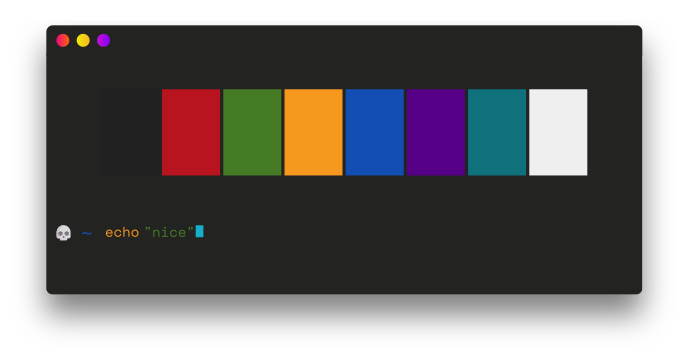
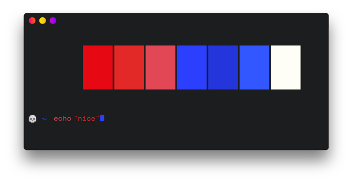

import BadColors from "@/components/BadColors.astro";

ANSI 16 colors can be literally anything. Each palette has slots for the `theme fg`, the `theme bg`, `Black`, `Red`, `Green`, `Yellow`, `Blue`, `Magenta`, `Cyan` & `White`. There's also a tricky and rarely used `reverse` ansi escape code which swaps fg & bg, so it is technically possible to use the `theme bg` as the fg. Confusing!

Your Mental Model

Your User

The tool below shows what your text might look like for the various Ghostty color themes. Hover a cell to see the theme name. As you can tell, there's really no combination that works for all themes apart from `theme fg` on `theme bg`. If you want a nice background color, you probably need to use ANSI 256 or truecolor.

<BadColors />
