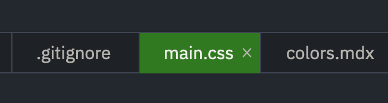

import { catppuccin } from "@/lib/palettes";
import Palette from "@/components/Palette.astro";

These days I use [Catppuccin Frappe](https://catppuccin.com) as my terminal
theme and I like sneaking these colors into various places. For example, I use
`One Dark Pro` in [zed](https://zed.dev) but I like it better with some
Catppuccin Green in there for visibility:

Here is Catppuccin for popular languages:

<Palette name="catppuccin" palette={catppuccin} />
