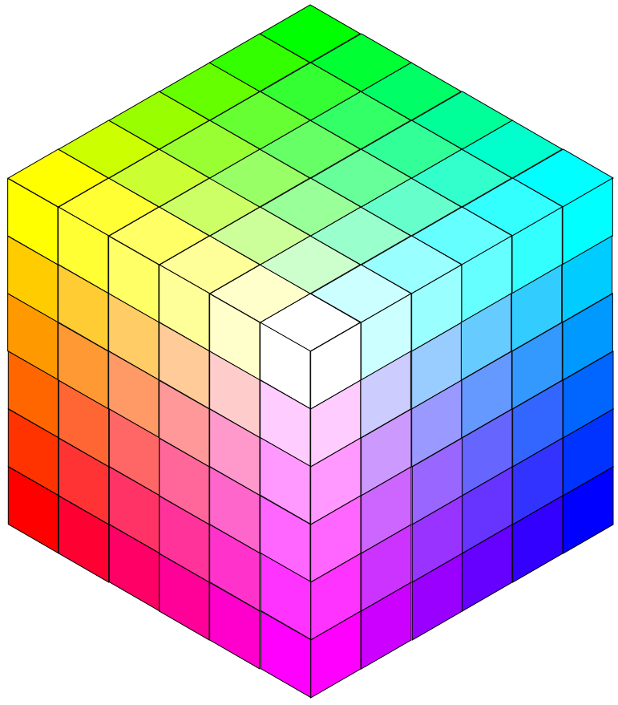
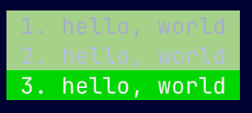

import Ansi from "@/lib/ansi";
import AnsiThemeTable from "@/components/AnsiThemeTable.astro";

Let me save you man-years of effort with three simple suggestions.

### 1. ANSI Safe

This table lists safe combinations of ANSI colors. "Safe" means that it is easy to make it look good. Notice that I avoid ANSI 16 (and ANSI 256 colors 0-15 which are the same thing). [Full explanation at the bottom](#avoid).

| name  | fg              | bg              | notes                                                                                                                   |
| ----- | --------------- | --------------- | ----------------------------------------------------------------------------------------------------------------------- |
| -     | -               | -               | It's normal and expected to use default (also known as "no color") for most output. Use ansi reset to get back to this. |
| fg    | ANSI 256 16-255 | -               | Pick a text color that works with the terminal theme (light vs dark)                                                    |
| fg+bg | ANSI 256 16-255 | ANSI 256 16-255 | You have control over both colors so it'll look good. May clash with terminal theme, though.                            |

### 2. ANSI 256

**ANSI 256** is totally sufficient for most apps. Avoid colors 0-15, they lie. When I say WHITE, I mean WHITE. Not off white. WHITE.

Feel free to go all the way to ANSI 16M, of course. As your app grows in popularity you will encounter oddball terminals that don't support it, so use a library that auto-downsamples.

BTW, the [ANSI 256 Color Cube](https://jakob-bagterp.github.io/colorist-for-python/ansi-escape-codes/extended-256-colors/) is pretty neat. It's algorithmic, though there have been attempts to name the colors since this was added in [1999](https://invisible-island.net/xterm/xterm.log.html#xterm_111). Thanks Todd!

<div class="mt-1 w-16"></div>

### 3. Be Thoughtful about Background

**Only set background color when inverting.** I usually leave the background color alone. This is the #1 thing you can do to make your app play nicely with the terminal theme. On the other hand, I love drawing attention to headers or important information by inverting colors. On a dark terminal that means true white foreground on a pretty, saturated background color. Vice versa for light terminals.

Special note on downsampling. It's trivial to write a function that takes an RGB color and finds the closest ANSI 256 16-255 color using euclidean distance. Be careful - that approach completely fails to take human vision into account. You might want to read [this](https://github.com/charmbracelet/x/blob/main/ansi/color.go), or at least ask your llm to consider the problem.

## Tools

Ansi.md has some dedicated tools for messing with color:

CODEX USE CHAPTERS.TS

<a name="avoid" />
## Avoid ANSI 16 & ANSI 256 0-15

I find this topic confusing so I'm putting extra details down here. All modern terminals let the user customize the "theme", which in effect means customizing ANSI colors 0-16. We are stuck with a primitive system for communicating color between apps and the host terminal. App says "color 4" and the terminal shows the color that the user picked for "blue".

For example, I use the https://github.com/catppuccin/ghostty/blob/main/themes/catppuccin-frappe.conf Ghostty theme, which is setup like this:

```
# catppuccin-frappe.conf ghostty theme
palette = 0=#51576d
palette = 1=#e78284
palette = 2=#a6d189
palette = 3=#e5c890
palette = 4=#8caaee
palette = 5=#f4b8e4
palette = 6=#81c8be
palette = 7=#a5adce
palette = 8=#626880
palette = 9=#e78284
palette = 10=#a6d189
palette = 11=#e5c890
palette = 12=#8caaee
palette = 13=#f4b8e4
palette = 14=#81c8be
palette = 15=#b5bfe2
...
```

#### Eight Normal Colors (Catppuccin Frappe)

<AnsiThemeTable rows={Ansi.catppuccin16.normal} />

and of course the anachronistically named "bright" colors are part of the theme:

#### Eight "Bright" Colors (Catppuccin Frappe)

<AnsiThemeTable rows={Ansi.catppuccin16.bright} bright />

#### Helpful Illustration

To refer back to the example at the top of this page,

```sh
# ansi16 white on ansi16 green (borked)
printf '\e[37;42m 1. hello, world \e[0m\n'

# ansi256 brightwhite on ansi256 green (borked)
printf '\e[38;5;15;48;5;2m 2. hello, world \e[0m\n'

# ansi 256 system white on ansi256 system green (AWESOMENESS)
printf '\e[38;5;255;48;5;40m 3. hello, world \e[0m\n'
```



When we try to create UI with the user's colors, things can go astray. That's why I avoid ANSI 16 and ANSI 256 0-15. Just because the internet calls that color "white" doesn't mean it's going to look anything like white. Don't be fooled!
