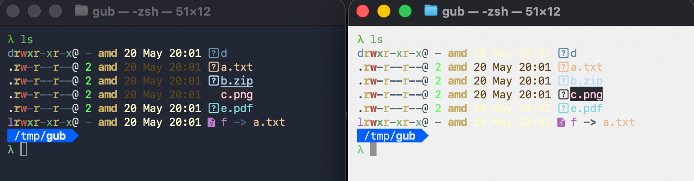

import Bits from "@/content/_bits.md";

Here at Ansi.md we love <span class="font-bold shimmer text-base">COLOR</span> and want to use it as much as possible. As such, there are three questions that cli apps need to answer:

1. Does the user even WANT color? Often the answer is no, like when piping to a file.
1. HOW MANY colors can the terminal handle? (16/256/16M)
1. If we turn on color, is the terminal DARK or LIGHT? The last thing we want is white text if the terminal uses a light background.

This is a colossal pain, so so so complicated, and flat out byzantine. We stand on the shoulders of giants and they tickle us relentlessly. I hesitate here because I find it difficult to begin...

## Does the user WANT color?

Your app is running, your hard work paid off, you have real users. Important question, does the user want to turn on color output or should we stick with black and white? Handy overview:

- **Is stdout a tty?** - If stdout is a tty, the user is NOT redirecting to a file or piping to another command. Sorry for the double negatives, but if stdout isn't a tty you may want to turn color off. Every language and library has a helper for this, you just gotta look for it. Note that some apps that are really focused on display might choose to leave color on anyway (like my tennis app). The user asked for a beautiful table, so I leave color on even if they pipe it into less.

- **$FORCE_COLOR=1 or $NO_COLOR=1** - I like to support these, they are easy for users and easy to implement. If you google this exciting topic you might encounter descriptions of env vars like `$CLICOLOR`, `$CLICOLOR_FORCE`. In my experience these are infrequently used and suffer from an excessive number of edge cases. What happens if they are set, but empty? What if `$CLICOLOR` is set to 0? Your LLM will repeatedly flag these edge cases as major issues but I can't find anyone who cares. Personally I think FORCE_COLOR/NO_COLOR are much more important than CLICOLOR/CLICOLOR_FORCE.

- **--color, --no-color, --color=on|off|auto|yes|true|false, --color=yep, etc.** - You might need these, depends on the app. My rule of thumb is that fun, display-oriented apps can skip these flags. Party poopers can use `$NO_COLOR=1` to suck the fun out of the terminal. I'm also not a fan because I can never recall which apps use `--color=on` and which use `--color=true` or `--color` all by itself.

- **Config precedence** - `--flags` > `$env` > defaults/`is_tty`. So if your app is running and `$NO_COLOR=1` and strangely `--color=on`, turn color on.

Luckily, there are excellent libraries to help tackle this complexity. For example, check out https://github.com/charmbracelet/colorprofile from our friends at Charm.

## HOW MANY colors (16/256/16M)?

Sometimes referred to as ANSI bit depth or color profile detection.

<Bits />

I have a whole separate page on color, so let's focus on detection here. Your app is running, does the terminal support 16, 256 or 16M colors? If you want to really go down the rabbit hole, give [terminfo](https://invisible-island.net/xterm/terminfo-contents.html) a quick scan, it's only 1,700 lines long.

Or take a look at Ghostty's valiant attempt to [stuff a custom entry](https://github.com/ghostty-org/ghostty/blob/main/src/terminfo/ghostty.zig) into terminfo on the fly. Some inside baseball here. When you ssh to a new host, ghostty attempts to update the `terminfo` database on that machine to teach it a bit about ghostty. This even works sometimes!

In 2026 all popular terminals support at least 256 colors, and the vast majority support 16M. If you can squeeze into 256 colors, just stop here. Be sure to read the [colors page](/colors), though, because you absolutely must understand (and probably avoid) the first 16 colors. I digress.

Sadly there are still a few exotic laggards like Windows Terminal, GitLab CI, etc. The worst offender was probably Apple Terminal, which added support for truecolor as part of the 2025 Tahoe release. Yes, the cursed Liquid Glass release also upgraded Terminal to support an additional 256\*256\*255 colors. As usual, don't ask me about Windows unless you want to hear an ignorant rant.

The easiest way to detect 16M is to look for `$COLORTERM=truecolor`. The terminal will kindly set this for your app to notice. Unfortunately this lovely env variable can easily get lost when using `ssh`, `tmux`, etc. We've lost `$COLORTERM`. How does https://github.com/crossterm-rs/crossterm handle this important case? This comment from crossterm kinda says it all:

```rust
/// This does not always provide a good result.
pub fn available_color_count() -> u16 {
    ...
}
```

Charm does [better](https://github.com/charmbracelet/colorprofile/blob/main/env.go), first pouncing on `$COLORTERM`, then sniffing `$TERM` for known terminal names, and finally checking the venerable terminfo database as a final, desperate resort.

My take: if you want full 16M, try to use ansi libraries that automatically detect and/or downsample to 256. Or you can ignore legacy terminals entirely and wait until someone complains. I actually moved `tennis` to 256 colors the first time I got a complaint from someone on an intel mac. Nobody noticed this massive change.

## DARK or LIGHT?

Does your terminal have a light or dark background? If you decide to venture beyond the first 16 ansi colors, this is a high stakes question. Get it wrong, your app looks bad. Not to pick on [eza](https://github.com/eza-community/eza), but it can look like this:



Luckily, it's quite easy to detect the terminal background color. Just put the fd in [raw mode](https://en.wikipedia.org/wiki/Terminal_mode), run an [OSC 11](https://invisible-island.net/xterm/ctlseqs/ctlseqs.html) query to get the background rgb color, calculate luma to determine "light" vs "dark" and you are all set! There are some minor wrinkles, of course, like not borking the terminal if it doesn't support OSC 11 for some reason. Easy fix - Send a [Ps 6](https://invisible-island.net/xterm/ctlseqs/ctlseqs.html) cursor position query, which generates a response in almost all terminals (even the ones that don't support OSC 11). Don't forget to exit raw mode, or the terminal never recovers. You may also want to set a timeout when reading from the raw console ([VTIME](http://www.unixwiz.net/techtips/termios-vmin-vtime.html)), though many languages don't expose that API. One additional complication, you can easily exceed this timeout if the user is running over ssh. Whoops. Also, for best results run this trivial check on `/dev/tty` when available.

I implemented this [in ruby](https://github.com/gurgeous/table_tennis/blob/main/lib/table_tennis/util/termbg.rb) and I kid you not it's one of the hairiest things I've ever attempted. I ported it [to zig](https://github.com/gurgeous/tennis/blob/main/src/termbg.zig) in a fit of rage. Don't even get me started on testing or `watchexec`, ha ha ha ha!

The real answer here is to use a library. Also, don't listen to your LLM when it says "this is easy to implement".

| lang       | lib                                                                              |
| ---------- | -------------------------------------------------------------------------------- |
| go         | https://github.com/dalance/termbg or https://github.com/charmbracelet/lipgloss/  |
| javascript | https://github.com/basiclines/os-theme, maybe?                                   |
| python     | [rich #1170](https://github.com/Textualize/rich/discussions/1170) "... it is impossible" |
| ruby       | https://github.com/gurgeous/table_tennis (apologies in advance)                  |
| rs         | https://github.com/muesli/termenv                                                |
| zig        | https://github.com/gurgeous/tennis (apologies in advance)                        |

### $COLORTERM Breakdown

On my machine I have an innocuous dir called `lib`, which houses the huge assortment of oss projects I looked at for this guide. If I search for `$COLORTERM` in there we can see all the various ways that people try to sniff term color support. Let's take a quick peek, shall we?

| name                                                                                           | lang | `$CLICOLOR` | `$FORCE/$NO`  | `$CI` | $TERM sniff | Windows   |
|------------------------------------------------------------------------------------------------|------|-------------|---------------|-------|-------------|-----------|
| [colorprofile](https://github.com/charmbracelet/colorprofile/blob/HEAD/env.go)                 | go   | yes         | - / y         | -     | extensive   | extensive |
| [termenv](https://github.com/muesli/termenv/blob/HEAD/termenv_unix.go)                         | go   | yes         | - / y         | yes   | extensive   | extensive |
||
| [colorama](https://github.com/tartley/colorama/blob/HEAD/colorama/ansitowin32.py)              | py   | -           | - / -         | -     | -           | extensive |
| [colored](https://gitlab.com/dslackw/colored/-/blob/master/colored/colored.py)                 | py   | -           | y / y         | -     | -           | a bit     |
| [rich](https://github.com/Textualize/rich/blob/HEAD/rich/console.py)                           | py   | -           | y / y         | -     | a bit       | extensive |
||
| [anstyle](https://github.com/rust-cli/anstyle/blob/HEAD/crates/anstyle-query/src/lib.rs)       | rs   | yes         | - / y         | yes   | a bit       | a bit     |
| [colored](https://github.com/mackwic/colored/blob/HEAD/src/control.rs)                         | rs   | yes         | - / y         | -     | -           | a bit     |
| [console-rs](https://github.com/console-rs/console/blob/HEAD/src/unix_term.rs)                 | rs   | yes         | - / y         | -     | a bit       | extensive |
| [crossterm](https://github.com/crossterm-rs/crossterm/blob/HEAD/src/style.rs)                  | rs   | -           | - / y         | -     | a bit       | extensive |
| [supports-color](https://github.com/zkat/supports-color/blob/HEAD/src/lib.rs)                  | rs   | yes         | y / y         | yes   | a bit       | a bit     |
||
| [ansis](https://github.com/webdiscus/ansis/blob/HEAD/src/color-support.js)                     | js   | -           | y / y         | yes   | a bit       | a bit     |
| [@colors/colors](https://github.com/DABH/colors.js/blob/HEAD/lib/system/supports-colors.js)    | js   | -           | y / -         | yes   | extensive   | extensive |
| [colors-cli](https://github.com/jaywcjlove/colors-cli/blob/HEAD/lib/supports-colors.js)        | js   | -           | - / -         | -     | a bit       | a bit     |
| [kolorist](https://github.com/marvinhagemeister/kolorist/blob/HEAD/src/index.ts)               | js   | -           | y / y         | yes   | a bit       | a bit     |
| [supports-color](https://github.com/chalk/supports-color/blob/HEAD/index.js)                   | js   | -           | y / -         | yes   | extensive   | extensive |

Don't read too much into the table above, this is not about completeness. IMO much of this detection is legacy since many older terminals have, uh, left us. Footnotes on the above:

- All of these libraries look at `$COLORTERM` and `is_tty`.
- `colorprofile` gets extra credit for trying to use `terminfo`.
- I consider `$CLICOLOR` & `$CLICOLOR_FORCE` legacy and I haven't seen them in the wild.
- "$TERM sniff" is when the libary looks at `$TERM` and/or `$TERM_PROGRAM`. For example, `colorprofile` looks for `wezterm` and many others in there.
- "Windows" is a vague attempt to measure the level of windows support, which also might involve a lot of sniffing for things like `ConEmu`. To which I say, who cares.


### See Also

If you google ansi truecolor, you'll find these three pages - [TrueColour.md gist](https://gist.github.com/XVilka/8346728), which moved to [termstandard/colors](https://github.com/termstandard/colors), and
the [kurahaupo gist](https://gist.github.com/kurahaupo/6ce0eaefe5e730841f03cb82b061daa2) which is a fork of the first gist. Lots of good info, though I ding all three for failing to notice that the main offender (Apple Terminal) finally added support for truecolor in 2025. Also see the `terminfo` section on my [Advanced](/advanced) page.
