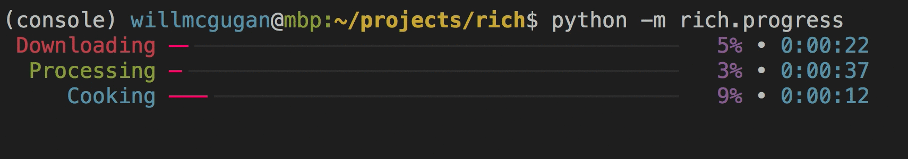

You've arrived at one of my favorites pages, the magical world of progress bars and spinners. I love the little details, the flourish that makes a cli feel fun. Aren't these things supposed to be fun?

It is SO EASY to add a progress bar and/or spinner to virtually any cli app these days. Libraries abound, often with easy-to-use APIs and color support Even if your favorite library is a bit dated, you can probably find a way to make it pretty.

My rule of thumb is that any operation that takes more than a second deserves a progress bar. Why make the user wait? Modern progress will often display a nice ETA before finally morping to "elapsed time" when the operation completes. Free logging! Seriously, apply liberally.

I look to https://github.com/Textualize/rich as a baseline of sorts for Progress Bar Technology:

Here are the features that I like to consider:

| what                            | why                                           |
| ------------------------------- | --------------------------------------------- |
| custom title like "Downloading" | nice, not essential                           |
| pretty colors                   | I refuse to use libs without color            |
| percent                         | actually not that important, but people enjoy |
| ETA                             | a must for long-running tasks                 |
| "indeterminate progress"        | I prefer spinners, usually                    |
| numeric indicator like xx/yy    | free logging                                  |
| shows time elapsed when done    | free logging                                  |

### How They Work

Creating progress bars and spinners from scratch is astonishingly easy. These libraries write a line of text (no newline), then emit a `\r` to move back to the first column and do it again. Simple, which probably explains why there are 10,000 different libraries out there.

A key detail that some libraries overlook is to use the ANSI show/hide cursor escape codes to make the white cursor square disappear for a bit. See [ANSI Escape Codes](/ansi) for hints on that one.

### Libraries

Typically in ansi.md I try to only recommend libraries that I personally use and recommend. This is a tough section for me because I haven't used progress bars across that many languages yet. In lieu of recommendations I'll just list some popular progress bar / spinner libraries. Chicken emoji means I've used and enjoyed.

| lang       | lib                                                                                                                                          |
| ---------- | -------------------------------------------------------------------------------------------------------------------------------------------- |
| go         | 🐔[progressbar](https://github.com/schollz/progressbar) [go-pretty](https://github.com/jedib0t/go-pretty)                                    |
| javascript | [node-progress](https://github.com/visionmedia/node-progress)                                                                                |
| python     | 🐔[tqdm](https://github.com/tqdm/tqdm) https://github.com/Textualize/rich [halo](https://github.com/manrajgrover/halo)                       |
| ruby       | 🐔[ruby-progressbar](https://github.com/jfelchner/ruby-progressbar) but see [#204](https://github.com/jfelchner/ruby-progressbar/issues/204) |
| rust       | 🐔[indicatif](https://github.com/console-rs/indicatif) [spinners](https://github.com/fgribreau/spinners)                                     |
| zig        | 😢                                                                                                                                           |

If you have opinionated recs please send 'em.
