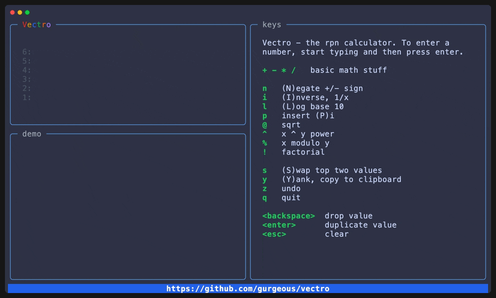

import vectro from "../assets/vectro.gif";

Most CLI apps run for a moment, write some lines, and then exit. Our old friend `ls` (well, https://github.com/eza-community/eza) fires itself up, spits out a few lines, and then exits. But there's a whole other category of full blown apps that hang around so you can interact with them. This kind of app is called a **Terminal User Interface**, or TUI for short. A broad definition includes stalwarts like `emacs` or `tmux`, but here I'm mainly focused on newer TUIs that strive for beautiful design and advanced layout.

Disclaimer - I've only written a handful of TUI apps, mostly unreleased. My favorite is probably [vectro](https://github.com/gurgeous/vectro). Unnecessary screenshot:

### TUI Library

Almost every TUI uses a well known TUI library. If you think about it for a sec, you'll realize that every TUI includes the equivalent of a web browser - an event loop, layout engine, and widgets.

The foundation of every TUI is a TUI library.

Building a TUI is incredibly complicated

Almost all TUI apps c

### TUI Apps

lazygit
nnn, yazi, eloi
claude, codex

Rust 	Ratatui, Cursive
Go 	Bubble Tea, tview, termui
Python 	Textual, Rich, urwid, prompt_toolkit, curses
C 	ncurses, notcurses
C++ 	FTXUI, ncurses
C#/.NET 	Terminal.Gui, Spectre.Console
JS/TS 	Ink, blessed, terminal-kit
Java 	Lanterna, JLine
Ruby 	TTY toolkit
Haskell 	Brick
Zig 	various emerging libraries
Shell 	dialog, whiptail, gum, fzf
